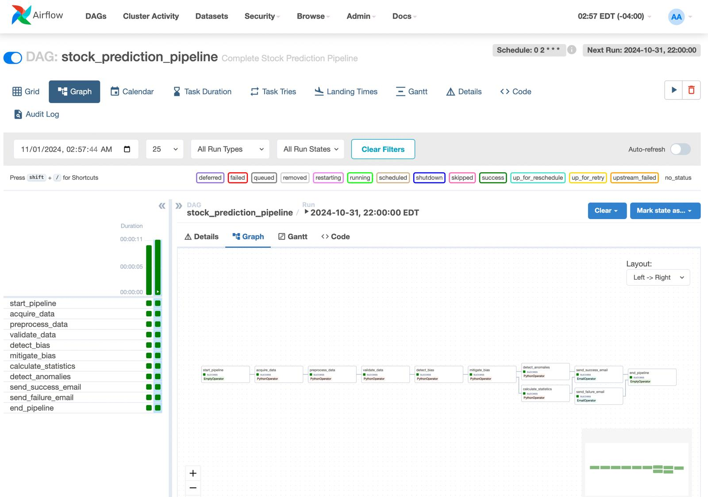
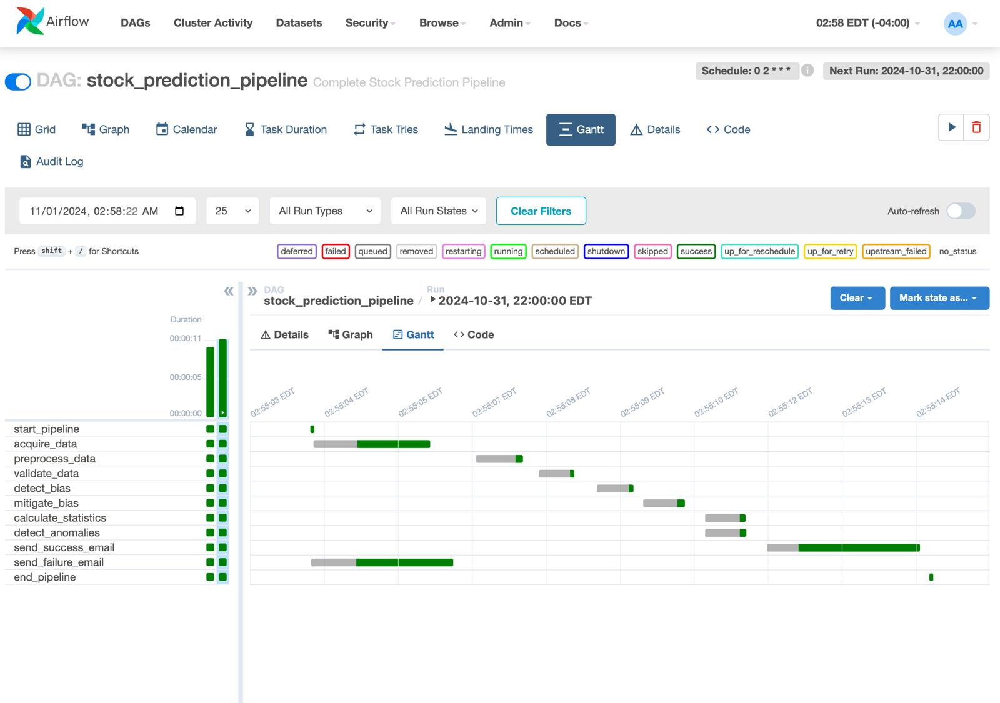

# Stock Price Prediction

[](https://www.python.org/)
[](https://www.docker.com/)
[](https://airflow.apache.org/)
[](https://cloud.google.com/vertex-ai)

---

## Video Link
[Click Here to Watch the Model Deployment Walkthrough Video](https://tinyurl.com/3tmrfadv)  

<p align="center">  
    <br>
	<a href="#">
	      
          
        
         
	
         
  </a>	
</p>
<br>
---

## Introduction
This project demonstrates a complete MLOps pipeline for predicting stock prices. It starts from raw financial market data and takes you through a series of automated steps: data ingestion, cleaning, feature engineering, bias detection and mitigation, anomaly analysis, model training with hyperparameter tuning, experiment tracking (MLflow), and finally deploying the best-performing and fairest model to a Vertex AI endpoint on Google Cloud. A Streamlit-based interface allows seamless interaction with the model’s predictions.

In essence, we’re building a pipeline that ensures every stage—from data to deployed model—is reliable, reproducible, transparent, and continuously improving.

---

## Dataset Information

**Data Source:** Yahoo Finance (via `yfinance`).

**Data Size:** About 252 rows × 7 columns of daily stock data per year per ticker.

**Features:**
- **Core:** Date, Open, High, Low, Close, Adj Close, Volume
- **Derived:** Returns, Moving Averages (MA5, MA20), Volatility, Anomaly Flags

These additional features help the model understand trends and patterns in stock price movements over time.

---

## Prerequisites
- **Python 3.9**
- **Docker & Docker Compose** for reproducible environments
- **Apache Airflow 2.x** for pipeline orchestration
- **DVC** (Data Version Control) to track data changes
- **MLflow** for experiment tracking
- **Vertex AI (GCP)** for automated model training (AutoML) and scalable deployment
- Optional: **Terraform** for infrastructure provisioning
- Libraries: `pandas`, `yfinance`, `scikit-learn`, `xgboost`, `fairlearn`, `shap`, `lime`

---

## Steps to Execute the Data Pipeline

1. **Clone the Repository:**
   ```bash
   git clone https://github.com/Venkata1106/MLOPS_Group2.git
   cd MLOPS_Group2
   ```

2. **Install Dependencies:**
   ```bash
   pip install -r requirements.txt
   ```

3. **Run Docker & Airflow Setup:**
   ```bash
   docker-compose up --build
   ```
   Access Airflow at `http://localhost:8080` (Credentials: `admin` / `admin`).

4. **Trigger the Airflow DAG:**
   In the Airflow UI, start the `stock_prediction_dag`.

5. **DVC (Optional):**
   ```bash
   dvc pull
   ```


   Ensures correct version of data is used.


## Data Pipeline Steps (What’s Happening)

1. **Data Acquisition:**  
   Fetches raw historical stock data using `yfinance`, essentially pulling daily price info from Yahoo Finance’s API.

2. **Preprocessing & Validation:**  
   Cleans data, handles missing values, generates features like returns and MAs, and validates the dataset to ensure no corrupted or missing critical info.

3. **Bias Detection & Mitigation:**  
   Checks if certain data segments might cause unfair model performance. If bias is found, applies reweighting or resampling so that all subsets are treated fairly.

4. **Anomaly & Slice Analysis:**  
   Identifies unusual patterns (e.g., sudden market shifts) and ensures consistent performance across different market conditions.

5. **Notifications & Logging:**  
   Sends success/failure notifications and logs pipeline runs for easy debugging.

6. **Data Versioning (DVC):**  
   Tracks data changes, enabling you to revert to previous data states and ensure complete reproducibility.


   
---

## Explaining the `src` Directory (Data Pipeline)

- **data_acquisition.py:** Downloads the raw stock data.
- **data_preprocessing.py:** Cleans the data, computes returns, MAs, volatility.
- **data_validation.py:** Ensures data meets schema expectations and no critical columns are missing.
- **bias_detection.py & bias_mitigation.py:** Identifies and reduces biases in certain data slices.
- **slice_analysis.py:** Evaluates data in subsets (e.g., volatility quartiles).
- **utils/**: Logging, monitoring, and other utilities to keep the pipeline transparent.

---


### MODEL DEVELOPMENT 

After the data pipeline provides a refined, bias-mitigated dataset, our focus shifts to **Model Development**. Here, we transform prepared data into a well-performing, fair, and interpretable predictive model. This phase is iterative, involving training, evaluation, fine-tuning, bias correction, explainability analysis, and thorough record-keeping.

**Key Objectives:**
- Convert preprocessed data into model-ready formats.
- Explore multiple ML algorithms to find a strong performer.
- Fine-tune hyperparameters to balance accuracy and robustness.
- Continuously check and rectify biases to ensure fairness.
- Validate the final model to ensure reliable real-world performance.
- Log every experiment (with parameters, metrics, and results) for transparency and reproducibility.
- Understand why the model makes certain predictions using explainability tools.
- Store the chosen model in a registry for easy retrieval and deployment.

**Detailed Steps and Rationale:**

1. **Data Loading & Splitting (`data_loader.py`):**  
   This script retrieves the processed dataset and splits it into training, validation, and test subsets.  
   - **Training Set:** Teaches the model patterns and trends.  
   - **Validation Set:** Helps tune hyperparameters and compare different models without overfitting.  
   - **Test Set:** Provides a final, unbiased measure of performance.  
   
   By segregating data this way, we maintain an honest benchmark and ensure that improvements in model performance are genuine.

2. **Model Training (`model.py`):**  
   Here we train multiple models (e.g., Random Forest, XGBoost). Trying diverse algorithms increases the chance of finding one well-suited to the market’s complexity. Some models excel in handling noise, while others can uncover subtle patterns. Training multiple candidates sets the stage for a fair, data-driven selection process.

3. **Hyperparameter Tuning (`hyperparameter_tuner.py`):**  
   Optimal hyperparameters often distinguish a good model from a great one. This script systematically explores parameter combinations—like the number of trees in a forest or the learning rate for a boosting model. The result is a model that’s both more accurate and more stable over time, reducing the risk of overfitting.

4. **Bias Checking (`bias_checker.py`):**  
   Fairness is not guaranteed by a single mitigation step. After training, we re-check the model’s predictions across various slices (e.g., volatility ranges) to detect residual bias. If certain subsets perform poorly, we re-tune or re-sample until fairness metrics improve, ensuring equitable treatment across all data segments.

5. **Model Validation & Selection (`model_validator.py` & `model_selector.py`):**  
   - **Model Validator:** Uses the test set to provide unbiased performance metrics (e.g., MSE, MAE).  
   - **Model Selector:** Ranks candidates by accuracy, fairness, and stability, choosing the model that best meets our criteria.  
   
   This two-step approach prevents deploying a model that merely “seems good” on training data but fails on unseen scenarios.

6. **Experiment Tracking (`experiment_tracker.py`):**  
   We leverage MLflow to log each run’s parameters, metrics, and artifacts. Historical records allow us to revisit past successes and failures, identify what worked well, and justify final choices to stakeholders. This ensures no valuable insight is lost during model iteration.

7. **Explainability (`sensitivity_analyzer.py`):**  
   Tools like SHAP and LIME clarify why the model makes certain predictions, revealing feature importance and dependencies. This transparency helps stakeholders trust the model and guides future improvements—if a model relies too heavily on a volatile feature, we can adjust the feature set or parameter tuning strategies.

8. **Model Registry (`model_registry.py`):**  
   Once the best model emerges, we store it in a registry—an authoritative record of the chosen model version. This eliminates confusion over which model is live, simplifies rollbacks if needed, and supports CI/CD pipelines for continuous improvement and reliable deployment.

---

###  Folder Structure Overview


```bash
MLOPS_Group2/
├── README.md                        # Project overview and instructions
├── requirements.txt                 # Dependencies for pipeline and training
├── modelrequire.txt                 # Additional dependencies for modeling & explainability
├── docker-compose.yml               # Config for running services (e.g., Airflow) in Docker
├── cloudbuild.yaml                  # CI/CD config (Google Cloud Build)
├── config/
│   ├── model_config.yml             # Model-specific parameters & hyperparameter ranges
│   └── pipeline_config.yml          # Pipeline-level configurations (paths, schedules)
├── credentials/                     # Encrypted credentials (not committed)
├── data/
│   ├── raw.dvc                      # DVC tracking for raw data versions
│   ├── processed.dvc                # DVC tracking for processed data versions
│   ├── mitigated/                   # Bias-mitigated datasets
│   └── stats/                       # Statistics, bias metrics, validation datasets
├── dags/
│   └── stock_prediction_dag.py      # Airflow DAG orchestrating data pipeline & model runs
├── docker/
│   └── airflow/
│       └── Dockerfile               # Dockerfile for building Airflow environment
├── docs/
│   └── bias_mitigation.md           # Documentation on bias detection & mitigation strategies
├── images/
│   ├── DAG.jpeg                     # Visual representation of the Airflow DAG
│   └── Gantt.jpeg                   # Project timeline or Gantt chart
├── models/
│   ├── bias_checker.py              # Checks model predictions for fairness issues
│   ├── bias_detection/              # Additional modules for slice-based bias metrics
│   ├── data_loader.py               # Splits processed data into train/val/test sets
│   ├── experiment_tracker.py        # Integrates with MLflow for logging experiments
│   ├── hyperparameter_tuner.py      # Automates search for optimal model hyperparameters
│   ├── model.py                     # Core training logic for ML models (e.g., RF, XGBoost)
│   ├── model_registry.py            # Manages final chosen model versions (registry)
│   ├── model_selector.py            # Compares models, picks the best candidate
│   ├── model_validator.py           # Tests chosen model on test set for unbiased performance
│   ├── sensitivity_analyzer.py      # Applies SHAP/LIME for interpretability & feature importance
│   ├── train.py                     # Orchestrates full model training, tuning, validation cycle
│   └── utils/
│       └── logger.py                # Logging configuration for model scripts
├── model_results/
│   ├── metrics_heatmap.png          # Visualizing performance metrics across runs
│   └── performance_comparison.png   # Comparing different models or hyperparameter sets
├── scripts/
│   ├── check_bias.py                # Standalone script for bias checks
│   ├── deploy_model.py              # Script to deploy model to Vertex AI or registry
│   ├── rollback_model.py            # For rolling back to a previous model version
│   ├── send_notifications.py        # Sends notifications (Slack, email) about pipeline runs
│   ├── test_endpoint.py             # Tests the live model endpoint predictions
│   ├── test_pipeline.py             # Integration tests for the entire pipeline
│   └── validate_model.py            # Additional validation logic
├── src/
│   ├── data_acquisition.py          # Fetches raw stock data from external sources (yfinance)
│   ├── data_preprocessing.py        # Cleans, enriches data with returns, MAs, volatility
│   ├── data_validation.py           # Ensures data integrity & completeness
│   ├── bias_detection.py            # Detects bias in raw data distributions
│   ├── bias_mitigation.py           # Applies strategies to fix identified biases
│   ├── slice_analysis.py            # Analyzes data subsets for performance consistency
│   └── utils/
│       ├── logging_config.py        # Logging configuration for data pipeline
│       └── monitoring.py            # Utility for pipeline health checks
└── tests/
    ├── test_basic.py                # Basic functionality tests
    ├── test_data_acquisition.py     # Tests data fetching logic
    ├── test_data_preprocessing.py   # Tests preprocessing steps
    ├── test_data_validation.py      # Tests validation logic
    └── conftest.py                  # Pytest configuration & fixtures

```


## Running Model Scripts

**First, install additional model dependencies:**
```bash
pip install -r modelrequire.txt
```
**Train and evaluate models:**
```bash
python models/train.py
```
**MLflow UI for Experiment Tracking:**
   ```bash
   mlflow ui
   ```
   Open `http://localhost:5000` to view experiment runs, metrics, and artifacts.

---
### Visualizations & Results
- **metrics_heatmap.png & performance_comparison.png:** Visual comparisons of model runs and hyperparameters.
- **Bias Reports:** JSON/PNG files showing if certain groups underperform.
- **SHAP/LIME Plots:** Reveal which features drive the model’s predictions.
- **MLflow UI:** `mlflow ui` to analyze runs and metrics in a clean interface.

---

## MODEL DEPLOYMENT

With Vertex AI (AutoML), we let GCP automatically train and select a top model. The chosen model is then deployed to a Vertex AI endpoint:

1. **GCP Setup:**  
   Authenticate with GCP, ensure Vertex AI and required APIs are enabled.

2. **From `vertex_ai` Directory:**
   ```bash
   pip install -r requirement.txt
   python predict.py
   streamlit run app.py
   ```
   The Streamlit app lets you input parameters and get real-time predictions from the deployed model.

### Monitoring & Retraining
- **Vertex AI Monitoring:** Watches performance and detects data drift.
- **CI/CD Pipelines:** If accuracy drops or data changes, automated retraining can be triggered, ensuring the model stays current and reliable.

---

## Full Project Flowchart
### Data Pipeline
<p align="center">
  <br />
  
</p>

### Model Development Pipeline
<p align="center">
  <br />
  
</p>
<br />

### Model deployment pipeline 
<p align ="center">	
  
</p>


---

## Tools and Technologies Used

| Tool/Technology | Purpose                                        |
|-----------------|------------------------------------------------|
| Python 3.9       | Data & ML scripting                           |
| Apache Airflow   | Orchestration & Scheduling                    |
| Docker           | Reproducible, portable environments           |
| DVC              | Data versioning and reproducibility           |
| MLflow           | Experiment logging & comparison               |
| Vertex AI        | AutoML training & scalable deployment         |
| Terraform (Opt.) | IaC for cloud resources                       |
| Pandas, yfinance | Data acquisition & manipulation               |
| scikit-learn, XGBoost | ML model frameworks                     |
| SHAP, LIME       | Model explainability                          |
| Fairlearn        | Bias detection & mitigation                   |
| GCP Monitoring   | Performance observation, detecting drift      |
| Streamlit        | User-friendly interface for predictions       |

---

## Cost & Resource Estimation
- **Local Environment:** Minimal (developer time, local hardware).
- **Cloud (GCP Vertex AI):** Compute for training/serving endpoints, storage for data and artifacts. A small-scale setup might cost ~$30-$60/month, scaling with data and complexity.

---

### Model Monitoring and Maintenance 

1. **Vertex AI Model Monitoring Activated:**  
   We have enabled Vertex AI’s model monitoring for our deployed AutoML model. This configuration continuously checks if incoming data diverges from the training baseline. For instance, over the past month, we’ve received alerts when certain input feature distributions (e.g., trading volume patterns) moved outside expected ranges. After reviewing these alerts, we updated our training datasets and triggered retraining to keep the model aligned with current market behaviors.

2. **Performance Alerts and Dashboards in Cloud Monitoring:**  
   Our team set up custom dashboards and alerts in Google Cloud Monitoring to track key performance metrics, such as prediction latency and error rates. Recently, when latency averaged above 400ms for a few days due to heightened market volatility, we received Slack notifications. Prompt action—adjusting configuration parameters—restored performance within hours, ensuring minimal impact on users.

3. **Regular Bias Checks on Live Predictions:**  
   A weekly Airflow task samples recent endpoint predictions and applies the same bias detection logic used pre-deployment. Two weeks ago, this check flagged a slight performance gap for highly volatile stocks. We responded by adjusting the dataset distribution and retraining the model, effectively restoring fairness metrics to baseline levels.

4. **Automated Retraining with CI/CD Pipelines:**  
   We integrated our GitHub repository with Vertex AI and CI/CD pipelines via GitHub Actions. When data drift or fairness alerts occur, an automated workflow pulls fresh data, reruns preprocessing and bias mitigation steps, triggers a new Vertex AI AutoML training job, and redeploys the improved model. This responsive process ensured timely adaptation when recent market sector rotations changed the feature importance landscape.

5. **Data Drift Dashboard for Stakeholder Transparency:**  
   We created a drift dashboard using GCP Monitoring and BigQuery, accessible to the entire team. By visualizing feature distribution shifts over time, stakeholders gain insight into why the model’s recommendations may differ month-to-month. This transparency fosters trust and informs decision-making around model updates.

6. **Historical Artifact Storage and Versioning:**  
   Each retraining event’s data snapshots, model artifacts, and metrics are recorded in MLflow and DVC. Several weeks ago, this historical record helped us pinpoint when prediction skew first appeared in specific industry segments and track how subsequent corrective measures improved model performance. This retrospective capability ensures data-driven improvement cycles.

7. **Expanding Slice Analysis Beyond Volatility:**  
   Rather than focusing exclusively on volatility slices, we rotate through different slicing criteria monthly—such as sector-based or liquidity-based segments. This rotation recently revealed underperformance in low-volume tech stocks, prompting targeted mitigation. By not relying on a single slicing strategy, we maintain broader coverage against evolving market challenges.

8. **Monthly Model Health Reports:**  
   We issue a “Model Health” report each month, summarizing data drift incidents, bias check outcomes, retraining triggers, and performance trends. Sharing these reports with both technical and non-technical stakeholders keeps everyone informed about the model’s ongoing adaptation and stability.

---


## Conclusion
By integrating Airflow, Docker, DVC, MLflow, Fairlearn, and Vertex AI, this MLOps pipeline ensures accurate, fair, and maintainable stock price predictions. Continuous monitoring and retraining capabilities keep the model up-to-date. The Streamlit interface makes predictive insights accessible, enabling stakeholders to confidently leverage the model’s outputs for informed decision-making.
```
